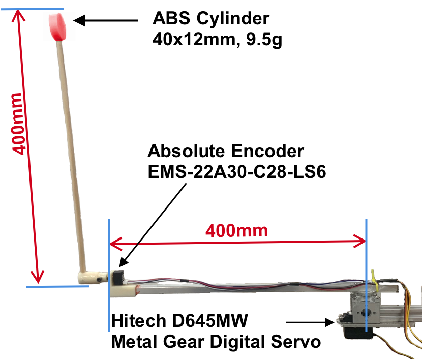

# Real-world Implementation of the Swing Up Pendulum

This is an implementation of the swing up pendulum for [ESP32S2](https://www.sparkfun.com/products/17743) board for Deep Reinforcement Learning training.

It uses MQTT protocol for communication (over WiFi).
The observations are streamed to `pendulum-r/obs/r01` and the actions need to be streamed to `pendulum-r/act/r01`.

### Building and Uploading
This is a [PlatformIO](https://platformio.org) project, so it requires platformIO to be installed.

Because the ESP32S2 is not yet fully supported, it requires a custom toolchain. 

For platformIO, find the toolchain in the [JSON file](https://raw.githubusercontent.com/espressif/arduino-esp32/gh-pages/package_esp32_index.json) from the __Installing using Boards Manager__ section.
Look for section `xtensa-esp32s2-elf-gcc` and download the toolchain for your platform.

Untar the file and copy the above JSON file inside and rename it to `package.json`.

Update the `platformio.ini` file to include:

    board_build.mcu = esp32s2
    platform_packages =
        toolchain-xtensa32s2@file:///home/xxx/install/xtensa-esp32s2-elf
        framework-arduinoespressif32@https://github.com/espressif/arduino-esp32.git#44c11981d2159565c551028f2498f65764607f74
        platformio/tool-esptoolpy @ ~1.30100

Basically, the toolchain-xtensa32s2 points to the dir with the downloaded toolchain.

The `framework-arduinoespressif32` section points to the github (the #44c11 is hash of version 2.0)

After that it's just:

    pio project init
    platformio run --target upload -e esp32thing_plus

Alternatively, you can use one of the supported IDEs like CLion or Visual Studio.

## Code
### Main
We are using Arduino rather than ESP-IDF (because the original version use Teensy 4.0), there are 2 main methods - `setup()` and `loop()`.
The first runs initialization code and the second is called repeatedly.

### Encoder
The encoder used is a low cost absolute encoder [EMS-22A30-C28-LS6](https://www.digikey.com/en/products/detail/bourns-inc/EMS22A30-C28-LS6/3693519).
It requires custom protocol for reading the values. It is implemented in [BournsEncoder.h](include/BournsEncoder.h).
The final reading used for training is mean of the last 3 readings (implemented through circular buffer).

### Servo Shield
The servo [Hitec D645MW](https://hitecrcd.com/products/servos/sport-servos/digital-sport-servos/d645mw/product) is controlled through [servo shield]( https://www.
adafruit.com/product/815).
This allows the MCU and servo to be powered separately and protect the MCU when servo fails (which does happen every few hundreds hours of operation).
